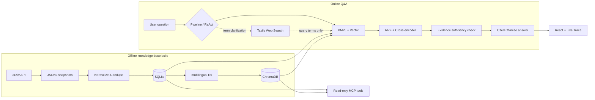

# AI/Agent Tech Radar

[中文](README.md) · **English**

A local knowledge assistant for AI agent research: it fetches arXiv papers in batches, uses hybrid retrieval and reranking to find evidence, and then generates cited Chinese answers through either a fixed RAG pipeline or a bounded ReAct agent.

This repository is also an incremental agent-engineering practice project. The focus is not on stacking frameworks, but on turning data ingestion, retrieval, tool calling, failure fallback, citation constraints, and execution observability into a complete, runnable, and testable pipeline.

## Current Capabilities

- Manually fetch arXiv in batches, save traceable JSONL snapshots, and import them idempotently into SQLite.
- Perform Chinese–English cross-lingual hybrid retrieval and reranking with multilingual E5, BM25, RRF, and a Cross-encoder.
- Support a fixed agentic RAG pipeline: query rewriting, evidence-sufficiency judgment, limited secondary retrieval, and refusal when evidence is insufficient.
- Support a bounded tool-calling ReAct loop: each round the model directly chooses local paper retrieval, optional web search, or emitting the final text, calling tools at most 5 times.
- Tavily web search is used only to clarify new terms and form more accurate paper queries; web content never becomes answer evidence and is not citable.
- A Tavily authentication failure disables the web tool for the current request; the error is fed back as a tool observation, letting the model choose another tool, clarify, or finish. Transient network or service errors get at most one retry.
- The React chat UI uses SSE to stream answer text, model usage, tool lifecycle, paper citations, persistent multi-conversation state, and agent-fallback status in real time; each conversation stores up to 100 turns, while the model still reads only the most recent 6.
- Provides a FastAPI HTTP API and a read-only Streamable HTTP MCP server protected by a Bearer token.
- All critical network boundaries are replaceable or mockable; tests run offline by default.

## System Flow



The system's core evidence boundary: the final answer may rely only on the arXiv papers stored in the local SQLite/ChromaDB. External web results, the model's prior knowledge, and the execution trace can never serve as citation sources.

## Tech Stack

| Layer | Technology |
|---|---|
| Data source | arXiv API |
| Current-state storage | SQLite |
| Vector index | ChromaDB |
| Retrieval | multilingual E5 + BM25 + RRF |
| Reranking | Cross-encoder |
| Model interface | OpenAI-compatible API |
| Backend | FastAPI + Server-Sent Events |
| Agent | Hand-written bounded ReAct loop |
| Tool protocol | MCP Streamable HTTP |
| Frontend | React 19 + TypeScript + Vite |
| Testing | pytest + Vitest |

## Quick Start

The current development environment is based on Windows, PowerShell, and Python 3.12.

### 1. Install dependencies

```powershell
python -m venv .venv
.\.venv\Scripts\Activate.ps1
python -m pip install -r requirements.txt

cd frontend
npm install
cd ..
```

Loading the embedding model and Cross-encoder for the first time may require downloading model files.

### 2. Configure the runtime environment

Create a `.env` file in the repository root that is not tracked by Git. The project intentionally does not ship a `.env.example`; configure the following variables as needed:

- `LLM_API_KEY`: required, the key for the OpenAI-compatible model service.
- `LLM_BASE_URL`: required, the API base URL of the model service.
- `LLM_MODEL`: required, the chat model name.
- `TAVILY_API_KEY`: optional; when absent, the ReAct `web_search` tool is disabled automatically.
- `MCP_AUTH_TOKEN`: required only when running the MCP server, at least 16 characters.
- `MCP_HOST`, `MCP_PORT`, `MCP_ALLOWED_HOSTS`: optional MCP network settings.

The frontend connects to `http://127.0.0.1:8000` by default. To change it, set `VITE_API_BASE_URL` in the ignored `frontend/.env.local`.

### 3. Prepare local paper data

List the preset arXiv queries:

```powershell
python -m ingestion.run_arxiv_ingestion --list-queries
```

Fetch a small batch and use the snapshot path printed by the command for the subsequent import:

```powershell
python -m ingestion.run_arxiv_ingestion --query-name agent_core --max-results 3
python -m ingestion.import_snapshot data/raw/<snapshot>.jsonl
python -m rag.indexer
```

Ingestion is a manual batch process; online Q&A never calls arXiv in real time. Snapshots, the SQLite database, and the ChromaDB index under `data/` are not committed to Git by default.

### 4. Start the web app

After installation, run the following from the repository root:

```powershell
.\start_services.ps1
```

The script starts FastAPI and Vite and opens `http://127.0.0.1:5173`. You can also start them separately:

```powershell
python -m uvicorn api.main:app --reload
```

```powershell
cd frontend
npm run dev
```

API docs are available at `http://127.0.0.1:8000/docs`.

## HTTP API

| Method | Path | Purpose |
|---|---|---|
| `GET` | `/health` | Process health check |
| `GET` | `/knowledge-base/stats` | Return SQLite paper count and vector count |
| `POST` | `/conversations` | Create a persistent conversation |
| `GET` | `/conversations` | List conversations by most recent update |
| `GET` | `/conversations/{id}` | Return full text and paper-citation history |
| `DELETE` | `/conversations/{id}` | Delete a conversation and its turns |
| `POST` | `/conversations/{id}/chat` | Return the complete answer and persist it |
| `POST` | `/conversations/{id}/chat/stream` | Stream status, tool events, text deltas, usage, and the final result over SSE |

The conversation-scoped chat endpoints support two modes, `pipeline` and `react`; a request contains only the question, `top_k`, and the mode. ReAct tool errors are first returned to the model as observations; only when the model or harness hits an unrecoverable error does it fall back to the reliable fixed pipeline and mark `fallback_used` in the response.

## MCP Server

The project also provides a standalone read-only MCP service:

```powershell
python -m mcp_server.main
```

The current tools are:

- `query_knowledge_base(query, top_k=3)`
- `get_paper_by_arxiv_id(arxiv_id)`
- `get_knowledge_base_stats()`

Clients must send a Bearer token when connecting to `/mcp`. See [docs/mcp.md](docs/mcp.md) for the full data boundary, configuration, and deployment notes.

## Verification

Run the backend tests from the repository root:

```powershell
python -m pytest
```

Run the frontend tests and production build inside `frontend/`:

```powershell
npm test
npm run build
```

Tests cover data normalization, idempotent import, retrieval, citations, refusal, conversation state, the tool-calling harness, streaming usage, web-search failures, and the HTTP/MCP boundaries.

## Project Structure

```text
api/            FastAPI routes, request contracts, and runtime lifecycle
config/         Query, model, MCP, and web-search configuration boundaries
frontend/       React chat UI, citation cards, and the live trace
ingestion/      arXiv fetching, normalization, snapshots, and SQLite import
mcp_server/     Read-only Streamable HTTP MCP adapter
rag/            Retrieval, reranking, fixed pipeline, ReAct agent, and answer generation
tests/          Python tests that run offline by default
docs/           ADR decision log and MCP usage notes
first.md        Full scope, learning roadmap, and phase-acceptance record
```

The FastAPI, MCP, and command-line entry points reuse the domain capabilities in `rag/`; network, storage, retrieval, and UI logic stay separated.

## Current Limitations and Roadmap

- The knowledge base currently uses only arXiv titles and abstracts, not full PDF text.
- Data updates are triggered manually; there is no scheduled ingestion or online incremental update.
- ReAct calls tools at most 5 times and records the token usage of each model call, but a request-level token cap is not yet in place.
- Web search introduces an indirect prompt-injection surface; its impact is currently limited by the "never becomes answer evidence" rule, and full guardrails are still to be implemented.
- The MCP shared token suits local development and controlled invitations; before public exposure it needs OAuth 2.1, per-user rate limiting, and an HTTPS reverse proxy.
- Information beyond the most recent 6 turns in a conversation is not yet rolled up into a summary, so from the 7th turn onward the model does not directly see earlier original text.
- Cross-conversation long-term memory, LangGraph, human-in-the-loop, and multi-agent orchestration are not yet introduced.

The next stage plans to implement in-conversation rolling summaries: the most recent 6 turns keep their original text, while earlier turns are compressed into an updatable summary. See [first.md](first.md) for the full milestones and [docs/decision-log.md](docs/decision-log.md) for key architectural trade-offs.

## Development Conventions

The project uses Conventional Commits and requires an ADR for important decisions about data sources, storage, models, frameworks, data contracts, deployment, and security. Run the backend tests, frontend tests, and frontend build before committing; see [AGENTS.md](AGENTS.md) for detailed collaboration constraints.
