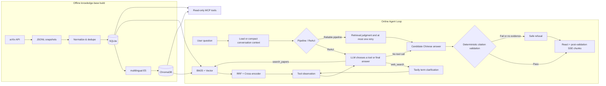

# AI/Agent Tech Radar

[中文](README.md) · **English**

[](https://github.com/juzikuwei/tech-radar-agent/actions/workflows/ci.yml)
[](LICENSE)

Ask it a technical question about AI agents: it first searches a local arXiv paper collection for evidence, then answers in Chinese with paper citations — and explicitly refuses when the evidence is insufficient instead of making something up.

This repository is also an incremental agent-engineering practice project: instead of starting from an agent framework, it uses a hand-written bounded ReAct loop to turn data ingestion, retrieval, tool calling, failure fallback, citation validation, and execution observability into a complete, runnable, and testable chain.

<!-- TODO(demo GIF): record a ~20s screen capture to replace the static screenshot. Suggested content: ask a question → tool calls appear in the trace → a cited answer arrives and an inline arXiv ID opens the paper → ask something outside the knowledge base → explicit refusal. -->


## What it does

- **Cited answers**: every technical claim is tied to a source arXiv paper, and validated inline paper IDs open the original paper page.
- **No fabrication**: deterministic citation validation runs before any answer is returned — citing papers outside the current evidence set, inventing IDs, or emitting a research answer without citations rejects the whole response; when retrieval finds nothing, the assistant says so explicitly.
- **Two answering modes**: a reliable fixed agentic RAG pipeline, or a bounded ReAct agent — the model decides what to search and how often (at most 5 tool calls per request) and falls back to the fixed pipeline on unrecoverable failure.
- **Cross-lingual retrieval**: Chinese questions can match English papers through multilingual E5 vectors, BM25 keywords, RRF fusion, and cross-encoder reranking.
- **Long-conversation memory**: the full conversation is kept permanently in SQLite; once the working context exceeds a token threshold, the oldest turns are compacted into a structured summary, so early constraints don't slide out of a fixed window.
- **Observable by default**: every model call and tool execution leaves a trace; the UI shows why the agent kept searching, stopped, failed, or fell back.
- **Multiple entry points**: a React chat UI (streaming over SSE), a FastAPI HTTP API, and an authenticated read-only MCP server.

## Quick Start

The current development environment is based on Windows, PowerShell, and Python 3.12.

### 1. Install dependencies

```powershell
python -m venv .venv
.\.venv\Scripts\Activate.ps1
python -m pip install -r requirements.txt

cd frontend
npm install
cd ..
```

Loading the embedding model and Cross-encoder for the first time may require downloading model files.

### 2. Configure the runtime environment

Create a `.env` file in the repository root that is not tracked by Git. The project intentionally does not ship a `.env.example`; configure the following variables as needed:

- `LLM_API_KEY`: required, the key for the OpenAI-compatible model service.
- `LLM_BASE_URL`: required, the API base URL of the model service.
- `LLM_MODEL`: required, the chat model name.
- `TAVILY_API_KEY`: optional; when absent, the ReAct `web_search` tool is disabled automatically.
- `CONVERSATION_CONTEXT_TOKEN_THRESHOLD`: optional estimated-token threshold that triggers batch compaction; defaults to `12000`.
- `CONVERSATION_CONTEXT_TARGET_TOKENS`: optional target for the uncompacted context after one compaction; defaults to `8000` and must be lower than the trigger threshold.
- `MCP_AUTH_TOKEN`: required only when running the MCP server, at least 16 characters.
- `MCP_HOST`, `MCP_PORT`, `MCP_ALLOWED_HOSTS`: optional MCP network settings.

The frontend connects to `http://127.0.0.1:8000` by default. To change it, set `VITE_API_BASE_URL` in the ignored `frontend/.env.local`.

### 3. Prepare local paper data

List the preset arXiv queries:

```powershell
python -m ingestion.run_arxiv_ingestion --list-queries
```

Fetch a small batch and use the snapshot path printed by the command for the subsequent import:

```powershell
python -m ingestion.run_arxiv_ingestion --query-name agent_core --max-results 3
python -m ingestion.import_snapshot data/raw/<snapshot>.jsonl
python -m rag.indexer
```

Ingestion is a manual batch process; online Q&A never calls arXiv in real time. Snapshots, the SQLite database, and the ChromaDB index under `data/` are not committed to Git by default.

### 4. Start the web app

After installation, run the following from the repository root:

```powershell
.\start_services.ps1
```

The script starts FastAPI and Vite and opens `http://127.0.0.1:5173`. You can also start them separately:

```powershell
python -m uvicorn api.main:app --reload
```

```powershell
cd frontend
npm run dev
```

API docs are available at `http://127.0.0.1:8000/docs`.

## Design idea: make the Agent Loop explicit first

The project deliberately starts with a small hand-written harness instead of introducing LangGraph or a larger Agent framework immediately. Its central loop is intentionally visible:

```text
user message
  → assemble system rules, compacted summary, raw pending turns, active evidence, and the current question
  → let the LLM choose a tool or emit final text
  → execute one tool
  → append the assistant tool call and tool observation to the message list
  → call the LLM again with the complete updated list
  → stop when the model returns no tool call
```

The responsibilities are separated on purpose:

- The LLM chooses the next action, but cannot bypass tool budgets or evidence rules.
- The harness validates and executes calls, maintains message state, and terminates the loop.
- A retrieval tool owns stable recall and reranking details instead of exposing storage-specific pseudo-tools to the model.
- Local paper results are the only source of technical facts. Web snippets, old assistant text, and conversation summaries are never citation evidence.
- Trace events describe the meaningful model/tool boundary so an Agent decision can be inspected without leaking every retrieval implementation stage.

This keeps the basic Agent Loop understandable before the project decides whether it genuinely needs graph orchestration, durable checkpoints, human approval, or multi-Agent coordination.

## How the tool-calling harness works

The core loop lives in `rag/research_agent.py` and is conceptually equivalent to:

```python
messages = build_initial_messages(question, context, active_evidence)

while True:
    tools = available_tools(call_budget, web_search_state)
    assistant = llm(messages=messages, tools=tools)
    messages.append(assistant)

    if not assistant.tool_calls:
        return grounded_final_answer(assistant.content)

    call = validate_first_tool_call(assistant.tool_calls, tools)
    observation = execute_tool(call)
    messages.append(observation)
```

The model currently sees two tools:

- `search_papers(query, top_k)`: searches the local paper collection. E5, BM25, RRF, and Cross-encoder reranking remain internal; the Agent decides when and what to search.
- `web_search(query, max_results)`: clarifies vague, new, or productized terminology for a later paper query. Web content is untrusted, non-citable, and never enters the final evidence set directly.

### Concrete harness policies

1. **Execute one tool per model turn.** If a provider still returns parallel calls, only the first is executed; the rest receive structured error observations and produce no hidden side effects.
2. **Build the tool menu dynamically.** An unavailable Tavily client or non-retryable authentication failure removes `web_search` from subsequent turns.
3. **Bound the loop deterministically.** A request may execute at most five tools, including at most two web searches. Once the budget is exhausted, one final model call receives no tools and must answer, clarify, or refuse from existing evidence.
4. **Return failures as observations.** Timeouts, rate limits, authentication failures, and invalid arguments become tool messages containing `error_type`, `retryable`, and `tool_available`.
5. **Enforce evidence in code.** A final research answer must contain at least one bracketed citation from the current evidence set, and any unknown arXiv ID anywhere in the answer invalidates the complete response. Paper cards, persisted IDs, active evidence, and inline hyperlinks use only validated cited papers. Web snippets, model memory, previous assistant text, and compacted context are not paper evidence.
6. **Keep a reliable outer boundary.** If the model or harness fails irrecoverably, the request falls back to the fixed agentic RAG pipeline and records the fallback in Trace.
7. **Observe meaningful boundaries.** ReAct Trace preserves model calls, tool lifecycle, errors, usage, and final output, while React merges start/completion pairs into product-level steps by default. The complete raw events remain expandable as technical details; dense retrieval, BM25, and rank fusion stay internal to one logical paper-search tool.

## Conversation context: immutable history and derived working memory

Conversations no longer use a fixed six-turn prompt window or a 100-turn storage cap:

```text
SQLite event log: every original user message, assistant answer, and paper ID
                         ↓
working context: structured summary + every still-uncompacted original turn
                         ↓
batch-compact the oldest complete turns after the token threshold
```

The default threshold is an estimated 12,000 tokens with an 8,000-token target. Large existing histories are summarized through bounded in-memory batches; SQLite receives the new summary and boundary only after every batch succeeds.

The summary contains goals, confirmed requirements, decisions, important context, and open questions only. Original paper records never enter the compaction model, and the summary can never support a technical claim or citation. A failed compaction preserves every raw message and does not silently return to truncation.

## System Flow



The system's core evidence boundary: the final answer may rely only on the arXiv papers stored in the local SQLite/ChromaDB. External web results, the model's prior knowledge, and the execution trace can never serve as citation sources.

## Tech Stack

| Layer | Technology |
|---|---|
| Data source | arXiv API |
| Current-state storage | SQLite |
| Vector index | ChromaDB |
| Retrieval | multilingual E5 + BM25 + RRF |
| Reranking | Cross-encoder |
| Model interface | OpenAI-compatible API |
| Backend | FastAPI + Server-Sent Events |
| Agent | Hand-written bounded ReAct loop |
| Tool protocol | MCP Streamable HTTP |
| Frontend | React 19 + TypeScript + Vite |
| Testing | pytest + Vitest |

## HTTP API

| Method | Path | Purpose |
|---|---|---|
| `GET` | `/health` | Process health check |
| `GET` | `/knowledge-base/stats` | Return SQLite paper count and vector count |
| `POST` | `/conversations` | Create a persistent conversation |
| `GET` | `/conversations` | List conversations by most recent update |
| `GET` | `/conversations/{id}` | Return full text and paper-citation history |
| `DELETE` | `/conversations/{id}` | Delete a conversation and its turns |
| `POST` | `/conversations/{id}/chat` | Return the complete answer and persist it |
| `POST` | `/conversations/{id}/chat/stream` | Stream status, tool events, post-validation text chunks, usage, and the final result over SSE |

The conversation-scoped chat endpoints support two modes, `pipeline` and `react`; a request contains only the question, `top_k`, and the mode. ReAct tool errors are first returned to the model as observations; only when the model or harness hits an unrecoverable error does it fall back to the reliable fixed pipeline and mark `fallback_used` in the response.

## MCP Server

The project also provides a standalone read-only MCP service:

```powershell
python -m mcp_server.main
```

The current tools are:

- `query_knowledge_base(query, top_k=3)`
- `get_paper_by_arxiv_id(arxiv_id)`
- `get_knowledge_base_stats()`

Clients must send a Bearer token when connecting to `/mcp`. See [docs/mcp.md](docs/mcp.md) for the full data boundary, configuration, and deployment notes.

## Verification

Run the backend tests from the repository root:

```powershell
python -m pytest
```

Run the frontend tests and production build inside `frontend/`:

```powershell
npm test
npm run build
```

Tests cover data normalization, idempotent import, retrieval, deterministic citation validation, zero-evidence refusal, token-triggered compaction, preservation of raw history, the tool-calling harness, post-validation SSE ordering, trusted citation links, Trace presentation merging, web-search failures, and the HTTP/MCP boundaries.

The entire backend suite runs offline by default: the LLM client, web search, and the embedding/reranking models are replaced with controllable fakes, so it needs no `.env` and downloads no model files. GitHub Actions CI runs all backend tests plus the frontend tests and production build with `HF_HUB_OFFLINE=1`.

Quality evaluation runs separately from pytest. `smoke` and `retrieval` only load the local knowledge base and local models; `agent`, `answer`, and `memory` call the answer model configured in `.env`. Generated reports are stored in the ignored `eval/results/`:

```powershell
python -m eval.run_eval --suite smoke
python -m eval.run_eval --suite retrieval --top-k 5
python -m eval.run_eval --suite agent --mode pipeline
python -m eval.run_eval --suite answer --mode react
python -m eval.run_eval --suite memory --mode pipeline
```

When first verifying the model-call boundary, append `--case-limit 1` to avoid running a full suite at once.

The retrieval dataset uses manually confirmed anchor papers, so reports include `Hit@K`, MRR, and optional NDCG instead of mislabeling incomplete annotation as full Recall. The agent suite scores structured actions, evidence reuse, and retrieval budgets deterministically; the answer suite checks citations, refusals, and keyword contracts; semantic completeness and claim-level groundedness still require human review.

## Project Structure

```text
api/            FastAPI routes, request contracts, and runtime lifecycle
config/         Query, model, MCP, and web-search configuration boundaries
frontend/       React chat UI, trusted citation links, citation cards, and concise trace views
ingestion/      arXiv fetching, normalization, snapshots, and SQLite import
mcp_server/     Read-only Streamable HTTP MCP adapter
rag/            Retrieval, reranking, fixed pipeline, ReAct agent, answer generation, and citation validation
eval/           Versioned quality cases, deterministic scorers, production adapters, and untracked reports
tests/          Python tests that run offline by default
docs/           ADR decision log and MCP usage notes
```

The FastAPI, MCP, and command-line entry points reuse the domain capabilities in `rag/`; network, storage, retrieval, and UI logic stay separated.

## Current Limitations and Roadmap

- The knowledge base currently uses only arXiv titles and abstracts, not full PDF text.
- Data updates are triggered manually; there is no scheduled ingestion or online incremental update.
- ReAct calls tools at most 5 times and records the token usage of each model call, but a request-level token cap is not yet in place.
- Web search introduces an indirect prompt-injection surface; its impact is currently limited by the "never becomes answer evidence" rule, and full guardrails are still to be implemented.
- The MCP shared token suits local development and controlled invitations; before public exposure it needs OAuth 2.1, per-user rate limiting, and an HTTPS reverse proxy.
- Context compaction uses a conservative provider-independent token estimate rather than the model's official tokenizer, so thresholds still need calibration from real usage.
- The rolling summary carries goals, constraints, decisions, and open questions only; it is never paper evidence, while original user messages, assistant responses, and paper records remain in trusted storage.
- Deterministic validation guarantees that citation IDs belong to the current evidence set, but it does not prove that every sentence is fully entailed by the cited abstracts; finer-grained claim-level groundedness still requires later evaluation or bounded reflection.
- Cross-conversation long-term memory, LangGraph, human-in-the-loop, and multi-agent orchestration are not yet introduced.

The next stage is to calibrate compaction thresholds with real long conversations and verify that early user constraints survive repeated batch compactions. See [docs/decision-log.md](docs/decision-log.md) for key architectural trade-offs.

## Development Conventions

The project uses Conventional Commits and requires an ADR for important decisions about data sources, storage, models, frameworks, data contracts, deployment, and security. Run the backend tests, frontend tests, and frontend build before committing; see [AGENTS.md](AGENTS.md) for detailed collaboration constraints.

## Note on answer language

The assistant currently generates final answers in Chinese, while retrieval is fully cross-lingual (Chinese and English queries both match the English arXiv corpus). Making the answer language configurable is a small, isolated change in the answer-generation prompt if you want an English-only deployment.
