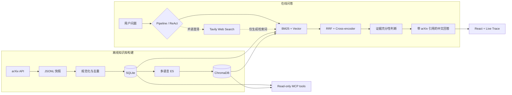

# AI/Agent Tech Radar

一个面向 AI Agent 技术研究的本地知识助手：批量收集 arXiv 论文，使用混合检索与重排寻找证据，再由固定 RAG 管线或有界 ReAct Agent 生成带引用的中文回答。

这个仓库也是一个渐进式 Agent 工程实践项目，重点不是堆叠框架，而是把数据摄取、检索、工具调用、失败降级、引用约束和执行可观测性做成可运行、可测试的完整链路。

## 当前能力

- 手动批量抓取 arXiv，保存可追溯 JSONL 快照，并幂等导入 SQLite。
- 使用 multilingual E5、BM25、RRF 和 Cross-encoder 完成中英跨语言混合检索与重排。
- 支持固定 Agentic RAG 管线：查询改写、证据充分性判断、有限二次检索和资料不足拒答。
- 支持有界 tool-calling ReAct：模型每轮直接选择本地论文检索、可选网页搜索或输出最终文本，最多调用 5 次工具。
- Tavily 网页搜索只用于澄清新术语和形成更准确的论文查询；网页内容不会进入回答证据，也不可引用。
- Tavily 认证失败会在当前请求内禁用网页工具；错误作为 tool observation 回填，由模型选择其他工具、澄清或结束。临时网络或服务错误最多保留一次重试机会。
- React 聊天界面通过 SSE 实时展示回答文本、模型 usage、工具生命周期、论文引用、持久多会话和 Agent 降级状态；每个会话最多保存 100 轮，模型仍只读取最近 6 轮。
- 提供 FastAPI HTTP API，以及带 Bearer Token 的只读 Streamable HTTP MCP Server。
- 关键网络边界均可替换或 mock；测试默认离线运行。

## 系统流程



系统的核心证据边界是：最终答案只能基于本地 SQLite/ChromaDB 中的 arXiv 论文。外部网页结果、模型既有知识和执行 Trace 都不能成为引用来源。

## 技术栈

| 层 | 技术 |
|---|---|
| 数据源 | arXiv API |
| 当前状态存储 | SQLite |
| 向量索引 | ChromaDB |
| 检索 | multilingual E5 + BM25 + RRF |
| 重排 | Cross-encoder |
| 模型接口 | OpenAI-compatible API |
| 后端 | FastAPI + Server-Sent Events |
| Agent | 手写有界 ReAct 循环 |
| 工具协议 | MCP Streamable HTTP |
| 前端 | React 19 + TypeScript + Vite |
| 测试 | pytest + Vitest |

## 快速开始

当前开发环境以 Windows、PowerShell 和 Python 3.12 为基准。

### 1. 安装依赖

```powershell
python -m venv .venv
.\.venv\Scripts\Activate.ps1
python -m pip install -r requirements.txt

cd frontend
npm install
cd ..
```

首次加载嵌入模型和 Cross-encoder 时可能需要下载模型文件。

### 2. 配置运行环境

在仓库根目录创建一个不会被 Git 跟踪的 `.env` 文件。项目故意不提供 `.env.example`，请按需要配置以下变量：

- `LLM_API_KEY`：必需，OpenAI-compatible 模型服务的密钥。
- `LLM_BASE_URL`：必需，模型服务的 API 地址。
- `LLM_MODEL`：必需，聊天模型名称。
- `TAVILY_API_KEY`：可选；缺失时自动禁用 ReAct 的 `web_search` 工具。
- `MCP_AUTH_TOKEN`：仅运行 MCP Server 时必需，至少 16 个字符。
- `MCP_HOST`、`MCP_PORT`、`MCP_ALLOWED_HOSTS`：可选的 MCP 网络设置。

前端默认连接 `http://127.0.0.1:8000`。如需修改，在被忽略的 `frontend/.env.local` 中设置 `VITE_API_BASE_URL`。

### 3. 准备本地论文数据

列出预设 arXiv 查询：

```powershell
python -m ingestion.run_arxiv_ingestion --list-queries
```

抓取一个小批次，并将命令输出的快照路径用于后续导入：

```powershell
python -m ingestion.run_arxiv_ingestion --query-name agent_core --max-results 3
python -m ingestion.import_snapshot data/raw/<snapshot>.jsonl
python -m rag.indexer
```

抓取是手动批处理；在线问答不会实时调用 arXiv。`data/` 中的快照、SQLite 数据库和 ChromaDB 索引默认不提交到 Git。

### 4. 启动 Web 应用

安装完成后，可以在仓库根目录运行：

```powershell
.\start_services.ps1
```

脚本会启动 FastAPI 和 Vite，并打开 `http://127.0.0.1:5173`。也可以分别启动：

```powershell
python -m uvicorn api.main:app --reload
```

```powershell
cd frontend
npm run dev
```

API 文档位于 `http://127.0.0.1:8000/docs`。

## HTTP API

| 方法 | 路径 | 用途 |
|---|---|---|
| `GET` | `/health` | 进程健康检查 |
| `GET` | `/knowledge-base/stats` | 返回 SQLite 论文数与向量数 |
| `POST` | `/conversations` | 新建持久会话 |
| `GET` | `/conversations` | 按最近更新时间列出会话 |
| `GET` | `/conversations/{id}` | 返回完整文本与论文引用历史 |
| `DELETE` | `/conversations/{id}` | 删除会话及其轮次 |
| `POST` | `/conversations/{id}/chat` | 返回完整问答结果并落库 |
| `POST` | `/conversations/{id}/chat/stream` | 通过 SSE 发送状态、工具事件、文本增量、usage 和最终结果 |

会话级聊天接口支持 `pipeline` 和 `react` 两种模式，请求只包含问题、`top_k` 和模式。ReAct 的工具错误会先作为 observation 返回模型；模型或 harness 出现不可恢复错误时，才降级到可靠固定管线，并在响应中标记 `fallback_used`。

## MCP Server

项目还提供独立的只读 MCP 服务：

```powershell
python -m mcp_server.main
```

当前工具包括：

- `query_knowledge_base(query, top_k=3)`
- `get_paper_by_arxiv_id(arxiv_id)`
- `get_knowledge_base_stats()`

客户端连接 `/mcp` 时必须发送 Bearer Token。完整的数据边界、配置和部署说明见 [docs/mcp.md](docs/mcp.md)。

## 验证

在仓库根目录运行后端测试：

```powershell
python -m pytest
```

在 `frontend/` 中运行前端测试与生产构建：

```powershell
npm test
npm run build
```

测试覆盖数据规范化、幂等导入、检索、引用、拒答、对话状态、tool-calling harness、流式 usage、网页搜索失败和 HTTP/MCP 边界。

## 项目结构

```text
api/            FastAPI 路由、请求契约与运行时生命周期
config/         查询、模型、MCP 和网页搜索配置边界
frontend/       React 聊天界面、引用卡片与实时 Trace
ingestion/      arXiv 抓取、规范化、快照与 SQLite 导入
mcp_server/     只读 Streamable HTTP MCP 适配器
rag/            检索、重排、固定管线、ReAct Agent 与回答生成
tests/          默认离线运行的 Python 测试
docs/           ADR 决策日志和 MCP 使用说明
first.md        完整范围、学习路线与阶段验收记录
```

FastAPI、MCP 和命令行入口复用 `rag/` 中的领域能力；网络、存储、检索和 UI 逻辑保持分离。

## 当前限制与路线图

- 知识库目前只使用 arXiv 标题与摘要，不读取 PDF 全文。
- 数据更新由人工触发，没有定时抓取或在线增量更新。
- ReAct 最多调用 5 次工具并记录每次模型调用的 token usage，尚未加入请求级 token 上限。
- 网页搜索带来间接 prompt injection 表面，目前通过“不进入回答证据”限制影响，完整 Guardrails 尚待实现。
- MCP 的共享 Token 适合本地开发和受控邀请；公开服务前需要 OAuth 2.1、按用户限流和 HTTPS 反向代理。
- 会话内超过最近 6 轮的信息尚未经过滚动摘要，因此第 7 轮以后模型不会直接看到更早原文。
- 尚未引入跨会话长期记忆、LangGraph、Human-in-the-Loop 或多 Agent 编排。

下一阶段计划是实现会话内滚动摘要：最近 6 轮保留原文，更早轮次压缩成可更新摘要。完整里程碑见 [first.md](first.md)，重要架构取舍见 [docs/decision-log.md](docs/decision-log.md)。

## 开发约定

项目使用 Conventional Commits，并要求重要数据源、存储、模型、框架、数据契约、部署和安全决定记录 ADR。提交前请运行后端测试、前端测试和前端构建；详细协作约束见 [AGENTS.md](AGENTS.md)。
