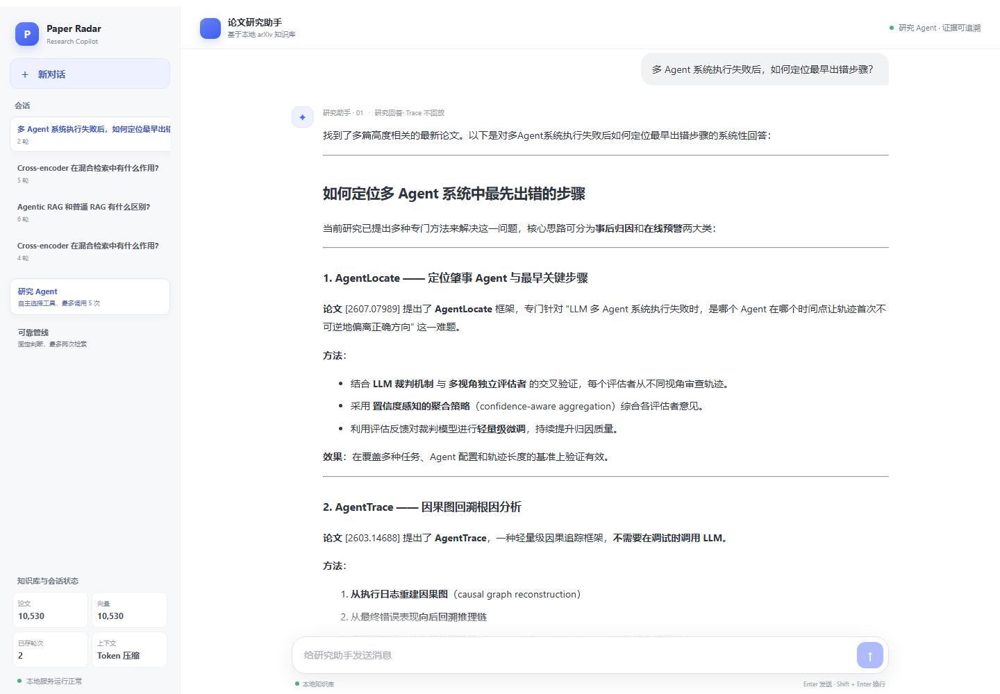
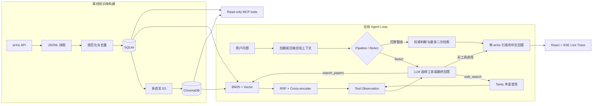

# AI/Agent Tech Radar

**中文** · [English](README.en.md)

一个面向 AI Agent 技术研究的本地知识助手：批量收集 arXiv 论文，使用混合检索与重排寻找证据，再由固定 RAG 管线或有界 ReAct Agent 生成带引用的中文回答。

这个仓库也是一个渐进式 Agent 工程实践项目，重点不是堆叠框架，而是把数据摄取、检索、工具调用、失败降级、引用约束和执行可观测性做成可运行、可测试的完整链路。



## 当前能力

- 手动批量抓取 arXiv，保存可追溯 JSONL 快照，并幂等导入 SQLite。
- 使用 multilingual E5、BM25、RRF 和 Cross-encoder 完成中英跨语言混合检索与重排。
- 支持固定 Agentic RAG 管线：查询改写、证据充分性判断、有限二次检索和资料不足拒答。
- 支持有界 tool-calling ReAct：模型每轮直接选择本地论文检索、可选网页搜索或输出最终文本，最多调用 5 次工具。
- Tavily 网页搜索只用于澄清新术语和形成更准确的论文查询；网页内容不会进入回答证据，也不可引用。
- Tavily 认证失败会在当前请求内禁用网页工具；错误作为 tool observation 回填，由模型选择其他工具、澄清或结束。临时网络或服务错误最多保留一次重试机会。
- React 聊天界面通过 SSE 实时展示回答文本、模型 usage、工具生命周期、论文引用、持久多会话和 Agent 降级状态；完整原始轮次持续保存在 SQLite，工作上下文达到 Token 阈值后自动批量压缩最早轮次，不再使用固定六轮窗口。
- 提供 FastAPI HTTP API，以及带 Bearer Token 的只读 Streamable HTTP MCP Server。
- 关键网络边界均可替换或 mock；测试默认离线运行。

## 项目思想：先把 Agent Loop 的边界做清楚

这个项目没有先引入 LangGraph 或复杂 Agent 框架，而是先用一个小型手写 harness 把最核心的循环做透明：

```text
用户消息
  → 重组 system、压缩摘要、未压缩历史、活动证据和当前问题
  → LLM 选择工具或输出最终文本
  → 执行一个工具
  → 把 assistant tool_call 和 tool observation 追加到消息列表
  → 使用完整消息列表再次调用 LLM
  → 直到模型不再调用工具
```

这样设计的目的不是减少代码量，而是让每个责任都有明确归属：

- LLM 决定下一步做什么，但不能绕过工具预算和证据规则。
- harness 负责执行工具、验证调用、维护消息状态和终止循环。
- 检索工具内部负责稳定的召回与重排，不把存储细节暴露给 Agent。
- 论文工具结果是唯一技术事实来源；网页结果、历史回答和会话摘要都不能成为引用证据。
- Trace 记录模型与工具边界，帮助解释 Agent 为什么继续、停止、失败或降级。

这使项目能够先理解 Agent Loop 本身，再判断什么时候确实需要状态图、持久 checkpoint、Human-in-the-Loop 或多 Agent 编排。

## Tool-calling harness 如何工作

核心循环位于 `rag/research_agent.py`，概念上接近下面的伪代码：

```python
messages = build_initial_messages(question, context, active_evidence)

while True:
    tools = available_tools(call_budget, web_search_state)
    assistant = llm(messages=messages, tools=tools)
    messages.append(assistant)

    if not assistant.tool_calls:
        return grounded_final_answer(assistant.content)

    call = validate_first_tool_call(assistant.tool_calls, tools)
    observation = execute_tool(call)
    messages.append(observation)
```

当前公开给模型的工具只有两个：

- `search_papers(query, top_k)`：调用本地论文检索。内部完成 E5、BM25、RRF 和 Cross-encoder，Agent 只需要决定何时检索以及使用什么查询。
- `web_search(query, max_results)`：只用于解释模糊、新出现或产品化术语，并帮助形成后续论文查询；网页内容不可信、不可引用，也不会直接进入最终证据集。

### Harness 中的具体工程处理

1. **每轮只执行一个工具。** 即使供应商返回并行工具调用，也只执行第一个；其余调用会收到结构化错误 observation，不会产生隐藏副作用。
2. **工具菜单是动态的。** Tavily 未配置或发生不可恢复的鉴权错误后，`web_search` 会从后续轮次的工具列表中移除，模型不能继续调用已经失效的工具。
3. **循环有确定性预算。** 每个请求最多执行 5 次工具，其中网页搜索最多 2 次。预算耗尽后再进行一次无工具模型调用，用已有证据回答、澄清或拒答。
4. **工具失败也是 Observation。** 超时、限流、鉴权失败和参数错误被转换成包含 `error_type`、`retryable`、`tool_available` 的工具消息，让模型基于真实状态改变策略。
5. **证据边界由代码维护。** 最终回答中的 arXiv ID 只能关联本轮工具或活动证据真实返回的论文；网页片段、模型记忆、旧助手回答和压缩摘要都不是论文证据。
6. **Agent 失败不等于请求失败。** 模型或 harness 出现不可恢复错误时，外层会降级到可靠的固定 Agentic RAG 管线，并保留降级 Trace。
7. **可观测性停在有意义的边界。** ReAct Trace 展示模型调用、工具调用、错误、usage 和最终输出；E5、BM25、RRF 等内部细节留在检索实现中，避免把一个逻辑工具拆成模型无法控制的伪工具。

## 会话上下文：完整原文与工作记忆分离

会话不再使用固定最近 6 轮窗口，也不再设置 100 轮存储上限：

```text
SQLite 完整事件日志：所有用户原话、助手回答、论文 ID，永久保留
                    ↓
工作上下文：结构化摘要 + 全部尚未压缩的原始轮次
                    ↓
达到 Token 阈值后，批量压缩最早的完整轮次
```

默认在估算上下文达到 12,000 Token 时触发压缩，目标降至约 8,000 Token。超长历史会分成多个有界批次，在内存中逐步合并摘要，只有全部批次成功后才原子更新 SQLite 中的摘要与压缩边界。

摘要只保存用户目标、明确要求、决定、重要上下文和未解决问题。论文原始记录不会进入压缩模型；摘要也不能作为技术事实或引用来源。压缩失败不会覆盖原始消息，也不会静默退回截断窗口。

## 系统流程



系统的核心证据边界是：最终答案只能基于本地 SQLite/ChromaDB 中的 arXiv 论文。外部网页结果、模型既有知识和执行 Trace 都不能成为引用来源。

## 技术栈

| 层 | 技术 |
|---|---|
| 数据源 | arXiv API |
| 当前状态存储 | SQLite |
| 向量索引 | ChromaDB |
| 检索 | multilingual E5 + BM25 + RRF |
| 重排 | Cross-encoder |
| 模型接口 | OpenAI-compatible API |
| 后端 | FastAPI + Server-Sent Events |
| Agent | 手写有界 ReAct 循环 |
| 工具协议 | MCP Streamable HTTP |
| 前端 | React 19 + TypeScript + Vite |
| 测试 | pytest + Vitest |

## 快速开始

当前开发环境以 Windows、PowerShell 和 Python 3.12 为基准。

### 1. 安装依赖

```powershell
python -m venv .venv
.\.venv\Scripts\Activate.ps1
python -m pip install -r requirements.txt

cd frontend
npm install
cd ..
```

首次加载嵌入模型和 Cross-encoder 时可能需要下载模型文件。

### 2. 配置运行环境

在仓库根目录创建一个不会被 Git 跟踪的 `.env` 文件。项目故意不提供 `.env.example`，请按需要配置以下变量：

- `LLM_API_KEY`：必需，OpenAI-compatible 模型服务的密钥。
- `LLM_BASE_URL`：必需，模型服务的 API 地址。
- `LLM_MODEL`：必需，聊天模型名称。
- `TAVILY_API_KEY`：可选；缺失时自动禁用 ReAct 的 `web_search` 工具。
- `CONVERSATION_CONTEXT_TOKEN_THRESHOLD`：可选；触发会话上下文批量压缩的估算 Token 阈值，默认 `12000`。
- `CONVERSATION_CONTEXT_TARGET_TOKENS`：可选；一次压缩后未压缩上下文的目标 Token 数，默认 `8000`，必须小于触发阈值。
- `MCP_AUTH_TOKEN`：仅运行 MCP Server 时必需，至少 16 个字符。
- `MCP_HOST`、`MCP_PORT`、`MCP_ALLOWED_HOSTS`：可选的 MCP 网络设置。

前端默认连接 `http://127.0.0.1:8000`。如需修改，在被忽略的 `frontend/.env.local` 中设置 `VITE_API_BASE_URL`。

### 3. 准备本地论文数据

列出预设 arXiv 查询：

```powershell
python -m ingestion.run_arxiv_ingestion --list-queries
```

抓取一个小批次，并将命令输出的快照路径用于后续导入：

```powershell
python -m ingestion.run_arxiv_ingestion --query-name agent_core --max-results 3
python -m ingestion.import_snapshot data/raw/<snapshot>.jsonl
python -m rag.indexer
```

抓取是手动批处理；在线问答不会实时调用 arXiv。`data/` 中的快照、SQLite 数据库和 ChromaDB 索引默认不提交到 Git。

### 4. 启动 Web 应用

安装完成后，可以在仓库根目录运行：

```powershell
.\start_services.ps1
```

脚本会启动 FastAPI 和 Vite，并打开 `http://127.0.0.1:5173`。也可以分别启动：

```powershell
python -m uvicorn api.main:app --reload
```

```powershell
cd frontend
npm run dev
```

API 文档位于 `http://127.0.0.1:8000/docs`。

## HTTP API

| 方法 | 路径 | 用途 |
|---|---|---|
| `GET` | `/health` | 进程健康检查 |
| `GET` | `/knowledge-base/stats` | 返回 SQLite 论文数与向量数 |
| `POST` | `/conversations` | 新建持久会话 |
| `GET` | `/conversations` | 按最近更新时间列出会话 |
| `GET` | `/conversations/{id}` | 返回完整文本与论文引用历史 |
| `DELETE` | `/conversations/{id}` | 删除会话及其轮次 |
| `POST` | `/conversations/{id}/chat` | 返回完整问答结果并落库 |
| `POST` | `/conversations/{id}/chat/stream` | 通过 SSE 发送状态、工具事件、文本增量、usage 和最终结果 |

会话级聊天接口支持 `pipeline` 和 `react` 两种模式，请求只包含问题、`top_k` 和模式。ReAct 的工具错误会先作为 observation 返回模型；模型或 harness 出现不可恢复错误时，才降级到可靠固定管线，并在响应中标记 `fallback_used`。

## MCP Server

项目还提供独立的只读 MCP 服务：

```powershell
python -m mcp_server.main
```

当前工具包括：

- `query_knowledge_base(query, top_k=3)`
- `get_paper_by_arxiv_id(arxiv_id)`
- `get_knowledge_base_stats()`

客户端连接 `/mcp` 时必须发送 Bearer Token。完整的数据边界、配置和部署说明见 [docs/mcp.md](docs/mcp.md)。

## 验证

在仓库根目录运行后端测试：

```powershell
python -m pytest
```

在 `frontend/` 中运行前端测试与生产构建：

```powershell
npm test
npm run build
```

测试覆盖数据规范化、幂等导入、检索、引用、拒答、Token 阈值压缩、原始历史保留、tool-calling harness、流式 usage、网页搜索失败和 HTTP/MCP 边界。

## 项目结构

```text
api/            FastAPI 路由、请求契约与运行时生命周期
config/         查询、模型、MCP 和网页搜索配置边界
frontend/       React 聊天界面、引用卡片与实时 Trace
ingestion/      arXiv 抓取、规范化、快照与 SQLite 导入
mcp_server/     只读 Streamable HTTP MCP 适配器
rag/            检索、重排、固定管线、ReAct Agent 与回答生成
tests/          默认离线运行的 Python 测试
docs/           ADR 决策日志和 MCP 使用说明
first.md        完整范围、学习路线与阶段验收记录
```

FastAPI、MCP 和命令行入口复用 `rag/` 中的领域能力；网络、存储、检索和 UI 逻辑保持分离。

## 当前限制与路线图

- 知识库目前只使用 arXiv 标题与摘要，不读取 PDF 全文。
- 数据更新由人工触发，没有定时抓取或在线增量更新。
- ReAct 最多调用 5 次工具并记录每次模型调用的 token usage，尚未加入请求级 token 上限。
- 网页搜索带来间接 prompt injection 表面，目前通过“不进入回答证据”限制影响，完整 Guardrails 尚待实现。
- MCP 的共享 Token 适合本地开发和受控邀请；公开服务前需要 OAuth 2.1、按用户限流和 HTTPS 反向代理。
- 会话压缩使用与供应商无关的保守 Token 估算，不等同于模型官方 tokenizer；需要根据真实 usage 分布校准阈值。
- 压缩只维护用户目标、约束、决定和未解决问题，不能作为论文事实证据；原始用户消息、助手回答和论文数据仍保存在可信存储中。
- 尚未引入跨会话长期记忆、LangGraph、Human-in-the-Loop 或多 Agent 编排。

下一阶段计划是用真实长会话校准压缩阈值，并验证早期用户约束在多次批量压缩后仍能稳定保留。完整里程碑见 [first.md](first.md)，重要架构取舍见 [docs/decision-log.md](docs/decision-log.md)。

## 开发约定

项目使用 Conventional Commits，并要求重要数据源、存储、模型、框架、数据契约、部署和安全决定记录 ADR。提交前请运行后端测试、前端测试和前端构建；详细协作约束见 [AGENTS.md](AGENTS.md)。
